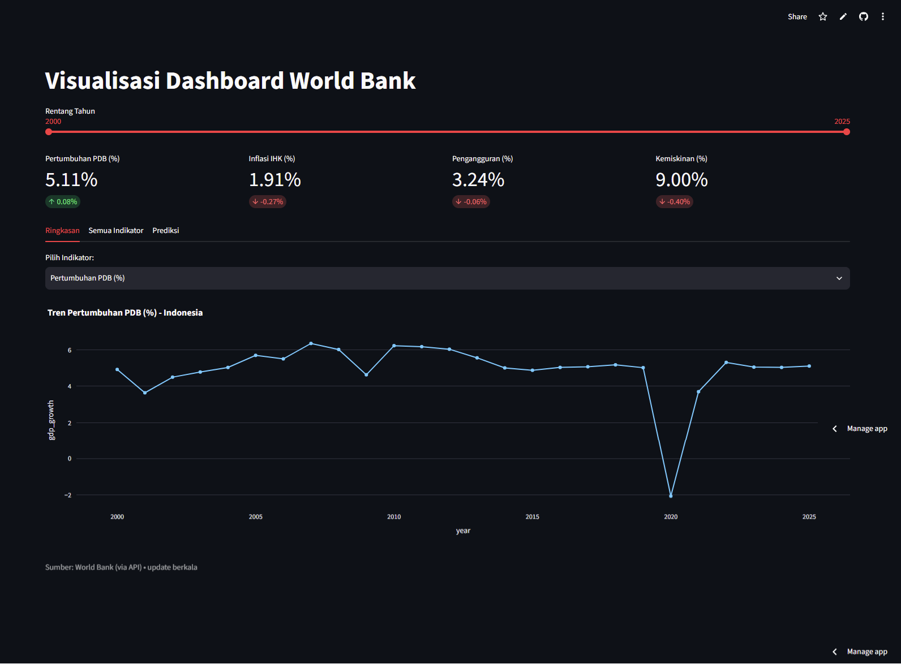
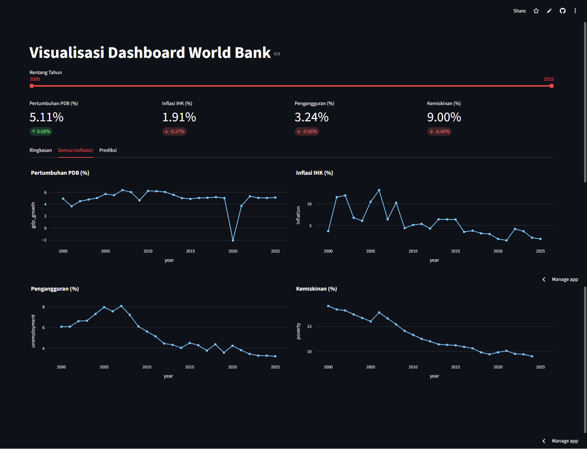
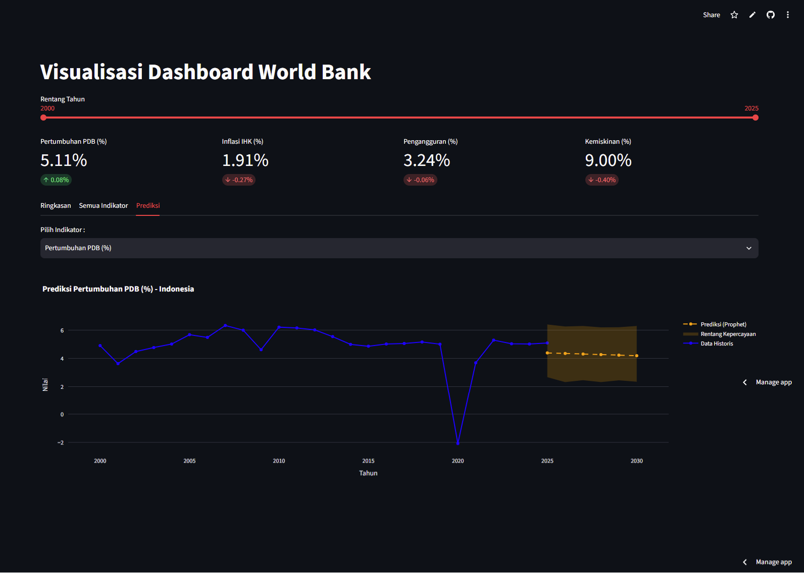

# 📊 Dashboard Ekonomi Indonesia

> Dashboard analitik interaktif: indikator makroekonomi Indonesia (World Bank), API FastAPI, peramalan Prophet, dan visualisasi Streamlit — dari pipeline data sampai live demo.

**🔗 Live demo:** [indo-economic-dashboard.streamlit.app](https://indo-economic-dashboard.streamlit.app/)

---

## ✨ Fitur

- **4 indikator makroekonomi** — Pertumbuhan PDB, Inflasi IHK, Pengangguran, Kemiskinan (data World Bank, 2000–sekarang)
- **KPI cards** — nilai terbaru + perubahan tahun sebelumnya
- **Mode offline** — dashboard otomatis beralih ke snapshot data lokal (parquet) saat API tidak tersedia

### 🖼️ Tampilan per Tab

**Tab 1 — Ringkasan** · pilih satu indikator, tren lengkap dengan slider rentang tahun



**Tab 2 — Semua Indikator** · grid 2×2 untuk membandingkan keempat indikator sekaligus



**Tab 3 — Prediksi** · data historis + proyeksi Prophet 5 tahun ke depan dengan rentang ketidakpastian



---

## 🏗️ Arsitektur

```
World Bank API (wbgapi)
        │
        ▼
data_fetchers/  ──(export)──►  data/*.parquet (snapshot offline)
        │
        ▼
forecasting/ (Prophet)
        │
        ▼
api/ (FastAPI + uvicorn)  ◄── HTTP JSON ──  dashboard/ (Streamlit + Plotly)
```

- **`data_fetchers/`** — ambil data World Bank (`wbgapi`, di-cache `lru_cache`) + `export_snapshot.py` untuk membekukan data & hasil forecast ke parquet
- **`forecasting/`** — model Prophet per indikator (seasonality off, data tahunan)
- **`api/`** — FastAPI: `GET /indicators`, `GET /indicators/{id}`, `GET /forecast/{id}`
- **`dashboard/`** — Streamlit: konsumen murni API via HTTP (tidak import layer lain); jika API tak terjangkau → fallback baca parquet

---

## 🐳 Docker

Dua cara menjalankan stack lengkap secara lokal:

**1. Docker Compose (2 container) — arsitektur microservice**

```bash
docker compose up -d
# API      → http://localhost:8000
# Dashboard→ http://localhost:8501  (memanggil API via nama service http://api:8000)
```

**2. Single container (deploy/Dockerfile)** — API + dashboard dalam satu image, `start.sh` menyalakan uvicorn (port 8000) di background dan Streamlit (port 7860) di foreground:

```bash
docker build -t econ-hf -f deploy/Dockerfile .
docker run -d -p 7860:7860 econ-hf
# → http://localhost:7860
```

---

## ⚙️ Instalasi Lokal (tanpa Docker)

```bash
git clone https://github.com/hasbiazif/indo-economic-dashboard.git
cd indo-economic-dashboard
python -m venv .venv
.venv\Scripts\activate            # Windows
pip install -r requirements.txt
```

Jalankan API lalu dashboard (dua terminal):

```bash
uvicorn api.main:app --reload     # terminal 1
streamlit run dashboard/app.py    # terminal 2 → http://localhost:8501
```

Perbarui snapshot parquet (data + hasil forecast terbaru):

```bash
python -m data_fetchers.export_snapshot
```

---

## 🗄️ Sumber Data

| Indikator | Kode World Bank | Catatan |
|---|---|---|
| Pertumbuhan PDB | `NY.GDP.MKTP.KD.ZG` | tahunan |
| Inflasi IHK | `FP.CPI.TOTL.ZG` | tahunan |
| Pengangguran | `SL.UEM.TOTL.ZS` | tahunan |
| Kemiskinan | `SI.POV.NAHC` | tahunan |

Sumber data BPS (neraca perdagangan, dsb.) direncanakan pada iterasi berikutnya.

---

## 🔮 Catatan Peramalan

Model Prophet dilatih per indikator pada data ≥2000 (era pasca-krisis; full-history membuat pita ketidakpastian melebar drastis karena memasukkan periode hiperinflasi 1998). Pada live demo, hasil forecast di-*pre-compute* ke parquet — bukan dihitung real-time — demi build yang ringan; secara lokal, endpoint `/forecast/{id}` menghitungnya langsung.

---

## 🛠️ Teknologi

Python 3.13 · wbgapi · pandas · FastAPI · uvicorn · Prophet · Streamlit · Plotly · Docker

---

## 📄 Lisensi

[MIT License](LICENSE)

---

> **Catatan:** Naskah README ini disusun dengan bantuan AI (Claude).
